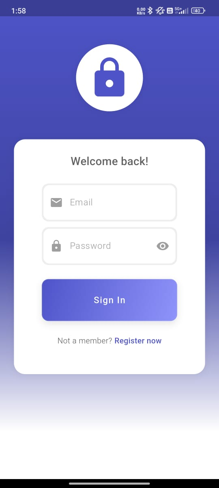
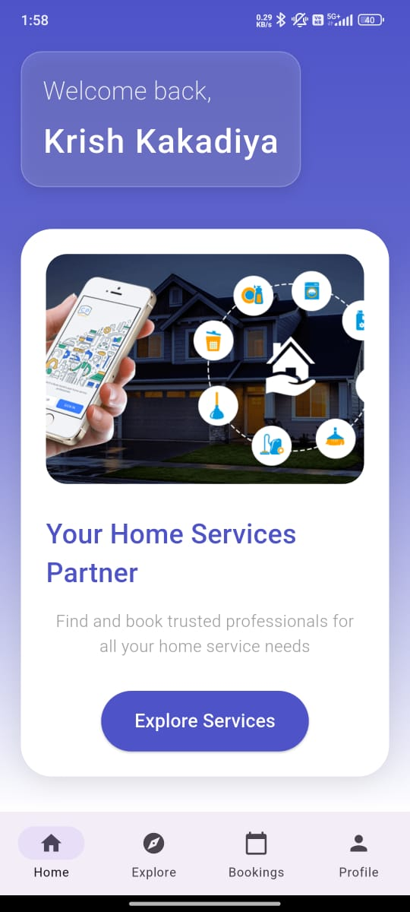
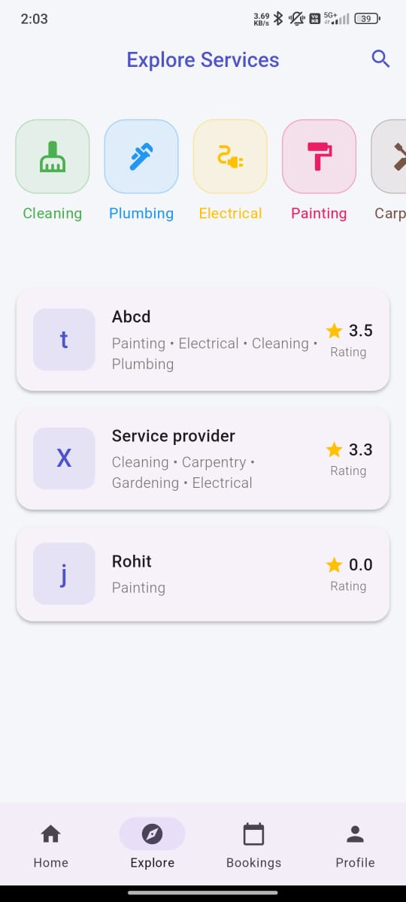
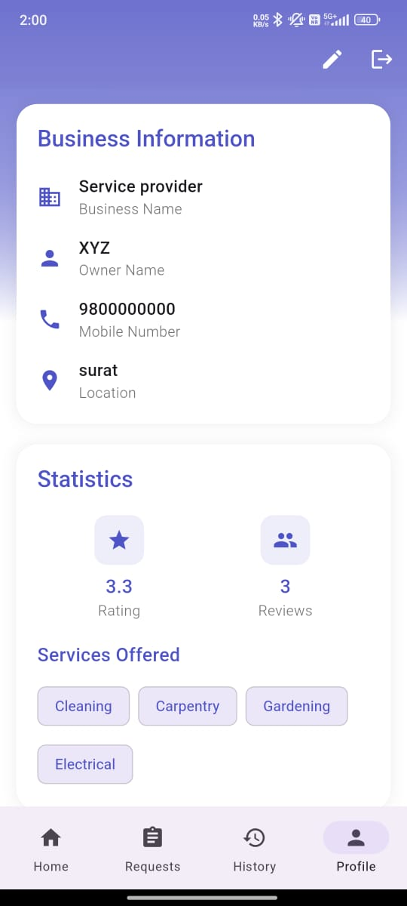

# 🛠️ Servicify

<div align="center">
  
  
  <p>A modern home services booking application built with Flutter</p>

  
  
  
</div>

## ✨ Features

- 🏠 **Dual User Interface** - Separate flows for customers and service providers
- 🔐 **Authentication** - Secure email & password authentication with Firebase
- 🎨 **Modern UI/UX** - Beautiful, responsive and intuitive design
- 📱 **Real-time Updates** - Live booking status and service request updates
- 🌙 **Theme Support** - Light mode support for better user experience
- 📍 **Location Services** - Integrated maps for service locations
- ⭐ **Ratings & Reviews** - Customer feedback system

## 📱 Screenshots

<table>
  <tr>
    <td>Login Screen</td>
    <td>Customer Home</td>
    <td>Service Booking</td>
    <td>Provider Dashboard</td>
  </tr>
  <tr>
    <td></td>
    <td></td>
    <td></td>
    <td></td>
  </tr>
</table>

## 🚀 Getting Started

### Prerequisites

- Flutter (3.0 or higher)
- Firebase account
- Android Studio / VS Code

### Installation

1. Clone the repository
```bash
git clone https://github.com/yourusername/Servicify.git
```

2. Install dependencies
```bash
flutter pub get
```

3. Configure Firebase
   - Create a new Firebase project
   - Add Android/iOS apps in Firebase console
   - Download and add configuration files
   - Enable Authentication and Firestore

4. Run the app
```bash
flutter run
```

## 🏗️ Architecture

The project follows a clean architecture pattern with the following structure:

```
lib/
├── components/      # Reusable UI components
├── models/         # Data models
├── pages/          # Screen UI
│   ├── customer/   # Customer specific screens
│   └── provider/   # Service provider screens
├── services/       # Business logic & API calls
└── utils/          # Helper functions & constants
```

## 🛠️ Built With

- [Flutter](https://flutter.dev/) - UI framework
- [Firebase](https://firebase.google.com/) - Backend & Authentication
- [Provider](https://pub.dev/packages/provider) - State management
- [Cloud Firestore](https://firebase.google.com/products/firestore) - Database

## 🤝 Contributing

Contributions are welcome! Please feel free to submit a Pull Request.

1. Fork the project
2. Create your feature branch (`git checkout -b feature/AmazingFeature`)
3. Commit your changes (`git commit -m 'Add some AmazingFeature'`)
4. Push to the branch (`git push origin feature/AmazingFeature`)
5. Open a Pull Request

## 📄 License

This project is licensed under the MIT License - see the [LICENSE](LICENSE) file for details

## 👥 Authors

- **Krish Kakadiya** - [YourGithub](https://github.com/krishkkdy)

## 🙏 Acknowledgments

- Hat tip to anyone whose code was used
- Inspiration
- etc
