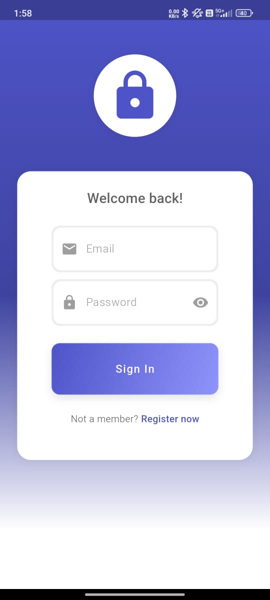

# 🏠 Servicify - Home Services Booking App

<div align="center">
  


  
A modern mobile application connecting customers with service providers for seamless home service booking and management.

</div>

## ✨ Features

- 🔐 User Authentication (Customer & Service Provider)
- 👤 Service Provider Profile Management 
- 👥 Customer Profile Management
- 🕒 Real-time Service Booking
- 📊 Booking Status Tracking
- 📝 Service History
- 🔔 Real-time Updates and Notifications
- 💳 Flexible Payment Options

## 🛠️ Technologies Used

- 📱 Flutter - UI Framework
- 🔥 Firebase Authentication - User Management
- 🗄️ Cloud Firestore - Database
- 📦 Firebase Storage - Media Storage
- ⚡ Flutter State Management

## 🚀 Getting Started

### Prerequisites

- 📌 Flutter SDK
- 🎯 Dart SDK
- 🔥 Firebase account
- 💻 Android Studio / VS Code
- 🐙 Git

### ⚙️ Installation

1. Clone the repository
```bash
git clone https://github.com/krishkkdy/Servicify.git
```

2. Navigate to project directory
```bash
cd Servicify
```

3. Install dependencies
```bash
flutter pub get
```

4. Run the app
```bash
flutter run
```

## 📁 Project Structure

```
lib/
  ├── models/         # Data models
  ├── pages/          # UI screens
  │   ├── customer/   # Customer-specific screens
  │   └── provider/   # Service provider screens
  ├── services/       # Business logic and services
  ├── widgets/        # Reusable widgets
  └── main.dart       # Entry point
```

## 📸 Screenshots

<div align="center">
  <div style="display: inline-block; margin: 20px; text-align: center;">
    
    <p><strong>Login Screen</strong></p>
  </div>

  <div style="display: inline-block; margin: 20px; text-align: center;">
    
    <p><strong>Home Screen</strong></p>
  </div>

  <div style="display: inline-block; margin: 20px; text-align: center;">
    
    <p><strong>Service Booking</strong></p>
  </div>

  <div style="display: inline-block; margin: 20px; text-align: center;">
    
    <p><strong>Profile Management</strong></p>
  </div>
</div>

## 🤝 Contributing

1. Fork the Project
2. Create your Feature Branch (`git checkout -b feature/AmazingFeature`)
3. Commit your Changes (`git commit -m 'Add some AmazingFeature'`)
4. Push to the Branch (`git push origin feature/AmazingFeature`)
5. Open a Pull Request

## 📜 License

Distributed under the MIT License. See `LICENSE` for more information.

## 📞 Contact

Krish Kakadiya - [@krishkkdy](https://github.com/krishkkdy)

Gmail - krishkkdy11@gmail.com
